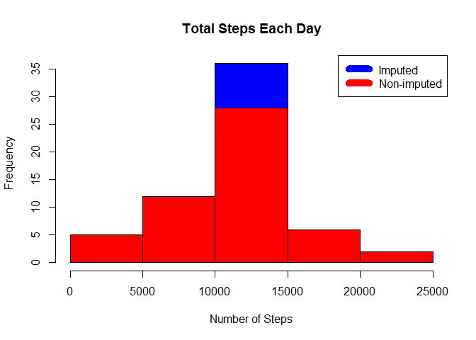

# Reproducible Research: Peer Assessment 1

##About

This is my first project for Reproducible Research course in Coursera's Data Science specialization track. The purpose of the project is to answer a series of questions using data collected from activity monitoring devices.

## Loading and preprocessing the data

Download, unzip and load data into data frame data.


```r
data <- read.csv("activity.csv")
```

## What is mean total number of steps taken per day?
Sum of steps per day, create a Histogram, and calculate mean and median.


```r
total_steps_by_day <- aggregate(steps ~ date, data, sum)
str(total_steps_by_day)
```

```
## 'data.frame':	53 obs. of  2 variables:
##  $ date : Factor w/ 61 levels "2012-10-01","2012-10-02",..: 2 3 4 5 6 7 9 10 11 12 ...
##  $ steps: int  126 11352 12116 13294 15420 11015 12811 9900 10304 17382 ...
```

```r
hist(total_steps_by_day$steps, main = paste("Total Steps Each Day"), col="blue", xlab="Number of Steps")
```

 

```r
rmean <- mean(total_steps_by_day$steps)
rmedian <- median(total_steps_by_day$steps)
```
* The `mean` is 1.0766189\times 10^{4}.
* The `median` is 10765.

## What is the average daily activity pattern?

* Calculate average steps for each interval for all days. 
* Plot the Average Number Steps per Day by Interval. 
* Find interval with most average steps. 


```r
steps_by_interval <- aggregate(steps ~ interval, data, mean)
plot(steps_by_interval$interval,steps_by_interval$steps, type="l", xlab="Interval", ylab="Number of Steps",main="Average Number of Steps per Day by Interval")
```

 

```r
max_interval <- steps_by_interval[which.max(steps_by_interval$steps),1]
```

The 5-minute interval, on average across all the days in the data set, containing the maximum number of steps is 835.

##Imputing missing values. Compare imputed to non-imputed data.

Calculate and report the total number of missing values in the dataset.


```r
summary(data)
```

```
##      steps                date          interval     
##  Min.   :  0.00   2012-10-01:  288   Min.   :   0.0  
##  1st Qu.:  0.00   2012-10-02:  288   1st Qu.: 588.8  
##  Median :  0.00   2012-10-03:  288   Median :1177.5  
##  Mean   : 37.38   2012-10-04:  288   Mean   :1177.5  
##  3rd Qu.: 12.00   2012-10-05:  288   3rd Qu.:1766.2  
##  Max.   :806.00   2012-10-06:  288   Max.   :2355.0  
##  NA's   :2304     (Other)   :15840
```

```r
incomplete <- length(which(is.na(data$steps)))
```
* The total number of rows with NAs is 2304

Missing values were imputed by inserting the average for each interval.


```r
imputed_data <- transform(data, steps = ifelse(is.na(data$steps), steps_by_interval$steps[match(data$interval, steps_by_interval$interval)], data$steps))
```

Recount total steps by day and create Histogram to show differences in between original dataset and imputed data.


```r
steps_by_day_i <- aggregate(steps ~ date, imputed_data, sum)
hist(steps_by_day_i$steps, main = paste("Total Steps Each Day"), col="blue", xlab="Number of Steps")
hist(total_steps_by_day$steps, main = paste("Total Steps Each Day"), col="red", xlab="Number of Steps", add=T)
legend("topright", c("Imputed", "Non-imputed"), col=c("blue", "red"), lwd=10)
```

 

Calculate mean and median for imputed data.


```r
rmean.i <- mean(steps_by_day_i$steps)
rmedian.i <- median(steps_by_day_i$steps)
```
* The imputed data mean is 1.0766189\times 10^{4}
* The imputed data median is 1.0766189\times 10^{4}


Calculate difference between imputed and non-imputed data.

```r
mean_diff <- rmean.i - rmean
med_diff <- rmedian.i - rmedian
```
* The difference between the non-imputed mean and imputed mean is 0
* The difference between the non-imputed mean and imputed mean is 1.1886792

Calculate total difference.

```r
total_diff <- sum(steps_by_day_i$steps) - sum(total_steps_by_day$steps)
```
* The difference between total number of steps between imputed and non-imputed data is 8.6129509\times 10^{4}.


##Are there differences in activity patterns between weekdays and weekends?


Create a new factor variable in the dataset with two levels, weekday and weekend.

```r
weekdays <- c("Monday", "Tuesday", "Wednesday", "Thursday", "Friday")
imputed_data$week_days = as.factor(ifelse(is.element(weekdays(as.Date(imputed_data$date)),weekdays), "Weekday", "Weekend"))
```
Calculate average steps for weekdays and weekends.

```r
steps_by_interval_i <- aggregate(steps ~ interval + week_days, imputed_data, mean)
```

Created a plot to compare and contrast number of steps between the week and weekend.


```r
library(lattice)
xyplot(steps_by_interval_i$steps ~ steps_by_interval_i$interval|steps_by_interval_i$week_days, main="Average Steps per Day by Interval",xlab="Interval", ylab="Steps",layout=c(1,2), type="l")
```

 
